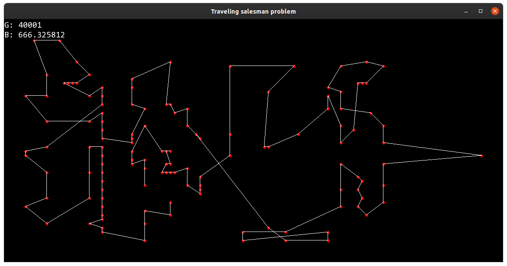

# Traveling Salesman Problem

Here you'll find my implementation of a solver for the traveling salesman problem, using a genetic algorithm.
The goal of this task is to find the shortest path between a set of cities, defined as points in a 2D space.

I implemented my solution in C++ (with SFML for the graphic visualisation), on a Linux environment.
The default `make` command builds without the graphics. You can compile the graphic version with the command `make graph`.

Run the program with the path to a .tsp file (samples can be found in [tours](tours/))
```
./tsp tours/xqf131.tsp
```

If you run the graphic version, make sure the program is run from the repository's root, the binary needs the font file located in [res](res/).

In graphic mode, when reaching the defined maximum number of generations, the simulation is paused but you can resumed it by pressing the space bar.
In normal mode, the program just exists.

## Results

My base parameters are:
- Generations: 1000
- Population size: 100
- Elite size: 20
- Mutation rate: 0.0005

Upon launch, the best distance begins around 4k then quickly drops to around 1.4k (or less), from there it slows down progressively but continues its progress until it reaches about 1k. Of course this result is not satisfying enough, so we're going to tweak the parameters:
- Generations: 3000
- Population size: 200
- Elite size: 40

With these (and some luck) we can get under the 900 distance mark. With 10k generations, the algorithm gets to a bit above 700. Pushing to the 20k generations brings us under the 700 mark.

